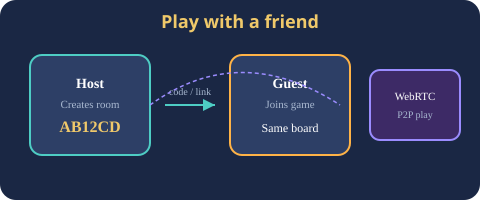
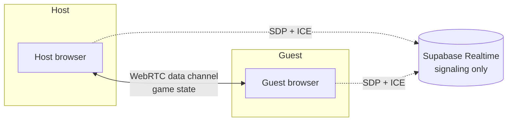
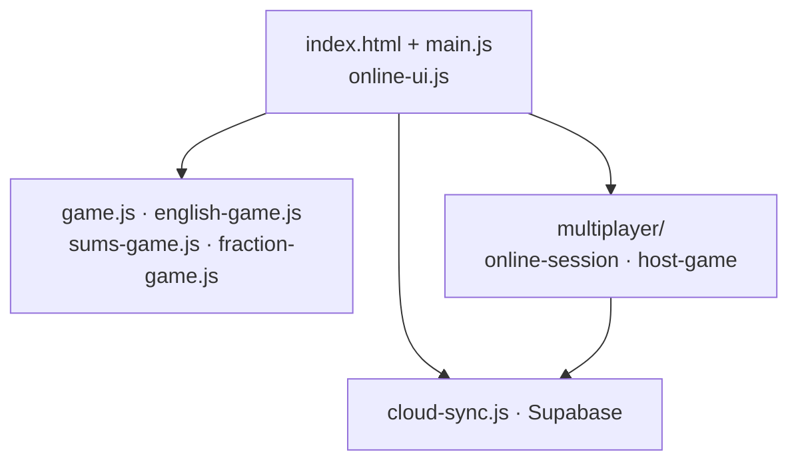

# Memory games — project overview

A browser-first learning game for kids: flip cards, find pairs, and practice **English**, **math**, **sums**, and **fractions**. Optional **cloud sync** (Supabase) saves per-player stats on a device. **Online multiplayer** lets two friends play the same board in real time.

| | |
|---|---|
| **Live demo** | [moranalgazi-cloud.github.io/memory-game](https://moranalgazi-cloud.github.io/memory-game/) |
| **Stack** | Vanilla JavaScript, Vite, Vitest |
| **Mobile** | Capacitor (Android); see [CAPACITOR.md](./CAPACITOR.md) |
| **Languages** | English and Hebrew (עברית) UI |

---

## What players see

1. **Choose a player** (name on this device) from the settings menu.
2. **Pick a game** and difficulty from the toolbar.
3. **Flip two cards** per turn; matching pairs stay face-up.
4. **Win** — confetti, applause, optional **Test me** quiz, then play again.

| Mode | What you match |
|------|----------------|
| **English 1** | Picture icon ↔ English word |
| **English 2** | Hebrew word ↔ English word |
| **Plus & minus** | Expression ↔ answer |
| **Multiplication** | Product ↔ equation (e.g. `7×8` ↔ `56`) |
| **Fractions** | Pie diagram ↔ fraction label |

English games pick a **random vocabulary topic** each round (animals, colors, jobs, and more). Speech synthesis reads words when enabled by level.

---

## Play with a friend (online)

- Open **Settings → Play online** (requires Supabase; see README).
- **Host:** choose game + level → **Create room** → share a **6-letter code** or link.
- **Guest:** **Join** → enter code → same board, take turns.
- **Give up** ends the game for you; your friend wins.
- After a match: **confetti for the winner**, then **Play again with friend** or **Leave game**.

Technical summary: **WebRTC** data channel for gameplay (host-authoritative); **Supabase Realtime** only for signaling (offer/answer/ICE). No game state is stored in the database for v1.

---

## Architecture (high level)

| Area | Role |
|------|------|
| `src/main.js` | Board, turns, win flow, settings, records, quiz |
| `src/online-ui.js` | Online dialog, host/join, quit, rematch |
| `src/multiplayer/` | Signaling, WebRTC, seeded decks, protocol |
| `src/records.js` | Local (and optional cloud) stats per player |
| `supabase/` | SQL for player stats; Realtime notes for online |

**Tests:** 46+ Vitest cases (`npm run test:run`) covering decks, room codes, and online deck generation.

---

## Optional features

- **Records** — best times and games won per mode (per local player).
- **Test me** — short quiz after winning, based on the deck you just played.
- **Admin** — password-gated overview when configured (local + cloud player list).
- **Finish** (admin only) — skip to end of game for testing; online host can force a win in P2P.

---

## Screenshots (optional)

The diagrams above are built-in SVGs. For marketing or README screenshots, capture from the live demo and save under `docs/images/`, for example:

| File | Suggested capture |
|------|-------------------|
| `screenshot-home.png` | Toolbar + empty or mid-game board |
| `screenshot-online-dialog.png` | Start / Join online dialog with room code |
| `screenshot-win.png` | Win message + confetti |

Then reference them in this file or the root README.

---

## Legal

Use and distribution are subject to the project disclaimer: **[DISCLAIMER.md](./DISCLAIMER.md)** (no warranty; limitation of liability; not legal advice).

---

## Repository quick links

- [README](../README.md) — install, run, build, test  
- [DISCLAIMER.md](./DISCLAIMER.md) — liability disclaimer  
- [CAPACITOR.md](./CAPACITOR.md) — Android app  
- [supabase/online-realtime.md](../supabase/online-realtime.md) — online setup  
